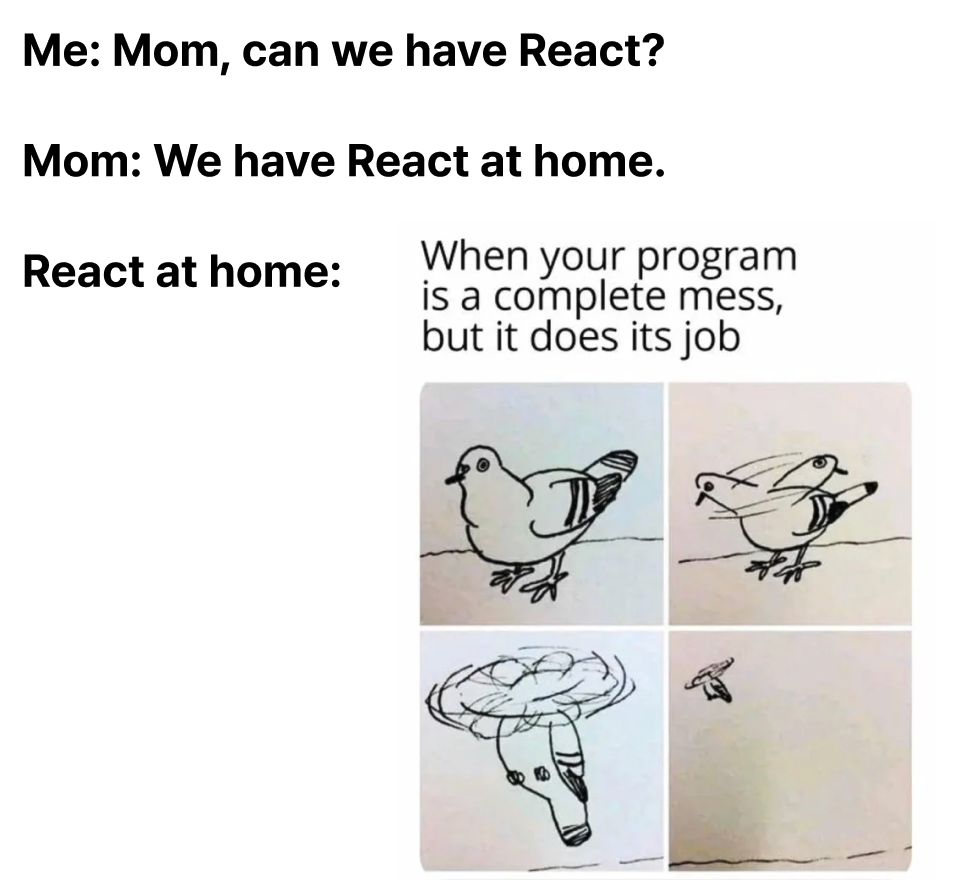

# ⚛️ 집에서 리액트 만들기

## 소개

이번 학기 스터디 주제는 "미니 React 만들기" 입니다.
React를 사용해본 사람은 많지만, 내부적으로 어떻게 동작하는지까지 이해하는 경우는 많지 않습니다.

이번 스터디에서는 React의 핵심 구조를 직접 구현하며,
JSX → Virtual DOM → Fiber → Scheduler 로 이어지는 렌더링 과정을 단계별로 탐구합니다.
React를 단순히 사용하는 수준을 넘어, 동작 원리를 이해하고 설계할 수 있는 개발자로 성장하는 것을 목표로 합니다.

## 📚 학습 주제

1.  Virtual DOM
    JSX를 Virtual DOM 구조로 변환하고, 이를 Fiber 단위로 분할해 렌더링합니다.
    → React가 Virtual DOM을 사용하는 이유와 렌더링 최적화 원리를 이해합니다.

2.  상태 관리
    TypeScript의 reflect-metadata 또는 클로저(Closure)를 활용하여,
    컴포넌트 상태 변경 시 Proxy 객체를 통해 자동으로 리렌더링되는 반응형 시스템을 구현합니다.

3.  Reconciliation (Diff & Commit)
    이전 Fiber 트리와 새로운 트리를 비교(Diff)하여,
    변경된 부분만 DOM에 반영하는 과정을 학습합니다.
    → React가 왜 key 속성을 요구하는지, Diff 알고리즘이 어떻게 동작하는지 이해합니다.

4.  이벤트 시스템
    Virtual DOM 상의 onClick, onInput 등의 이벤트를 탐지하고
    실제 DOM 이벤트로 매핑하는 시스템을 설계합니다.

5.  Concurrent Rendering
    Fiber, Scheduler, Lane 모델을 결합해
    렌더링을 중단·재개·우선순위 조정이 가능한 구조로 확장합니다.
    → React 18의 Concurrent Rendering 모델의 핵심을 직접 구현해봅니다.

6.  Commit Phase
    렌더링이 완료된 Fiber 트리를 실제 DOM에 한 번에 반영하고,
    라이프사이클과 사이드 이펙트를 순서 있게 처리합니다.
    → React 내부의 commitRoot, commitWork 단계의 역할을 이해합니다.

## 💡 스터디 방향

- 매주 핵심 개념을 정리하고, 함께 코드를 작성하며 완성해 나갑니다.
- React의 핵심 철학인 “왜 이렇게 동작하는가?”를 코드로 이해하는 것을 목표로 합니다.

